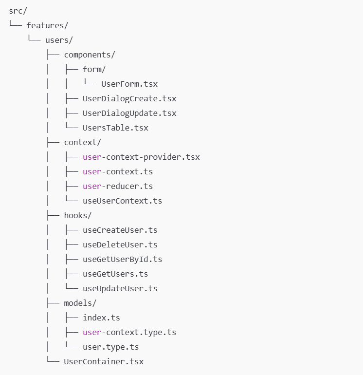

# CLi para crear CRUD's en React + TypeScript + Vite + Shadcn + Tan Stack Query + Tan Stack Router

### Instalación

```bash
npm install -g @qcode-co/crf
```

### Crear un nuevo módulo

Ingresar el nombre del módulo en camelCase y en singular.

```bash
crf user
```

Esto creará una carpeta en src/features con el nombre del módulo y los archivos necesarios para un CRUD.

